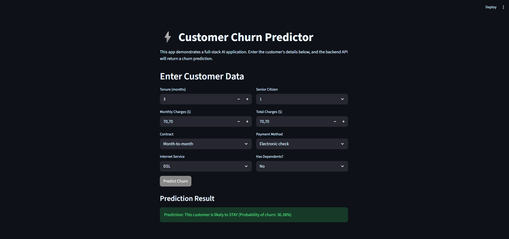

# Full-Stack Churn Prediction Application

### A complete AI application featuring a FastAPI backend for model serving and a Streamlit frontend for user interaction.


## Project Overview

This project demonstrates a professional, full-stack approach to deploying a machine learning model. It is structured as a **monorepo** containing two distinct but connected services:

1.  **`/backend`**: A robust REST API built with **FastAPI**. Its sole responsibility is to serve a pre-trained Scikit-learn model, handling data preprocessing and returning churn predictions. This is the "brain" of the application.

2.  **`/frontend`**: An interactive web dashboard built with **Streamlit**. It provides a user-friendly interface for inputting customer data and communicates with the backend API to display the model's predictions. This is the "face" of the application.

This client-server architecture is a standard industry practice for building scalable and maintainable AI-powered applications.

## Key Skills & Architecture

*   **Full-Stack Development:** Demonstrates the ability to build and connect separate backend and frontend services.
*   **Client-Server Architecture:** Clear separation of concerns between the model-serving API and the user-facing dashboard.
*   **API Development & Consumption:** The project involves both creating a FastAPI endpoint and consuming it from a separate application using the `requests` library.
*   **Monorepo Management:** The entire application is organized within a single Git repository, with separate environments and dependencies for each service.
*   **End-to-End MLOps:** Showcases the complete cycle from model training (`train_model.py`) to serving (`main.py`) and user interaction (`app.py`).

## How to Run This Project Locally

1.  **Clone the repository and set up both environments.**
    ```bash
    git clone https://github.com/takzen/churn-predictor-app.git
    cd churn-predictor-app

    # Set up backend
    cd backend
    uv venv -p 3.11 && source .venv/bin/activate
    uv pip install -r requirements.txt
    python train_model.py
    cd ..

    # Set up frontend
    cd frontend
    uv venv -p 3.11 && source .venv/bin/activate
    uv pip install -r requirements.txt
    cd ..
    ```

2.  **Run the Backend Server:**
    Open a new terminal, navigate to `/backend`, activate its environment, and run:
    ```bash
    uvicorn main:app --reload
    ```

3.  **Run the Frontend Application:**
    Open a second terminal, navigate to `/frontend`, activate its environment, and run:
    ```bash
    streamlit run app.py
    ```
    Your web browser will open with the running application.

## Dashboard Preview


*A preview of the interactive dashboard in action.*